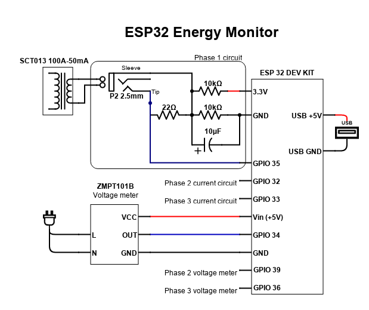
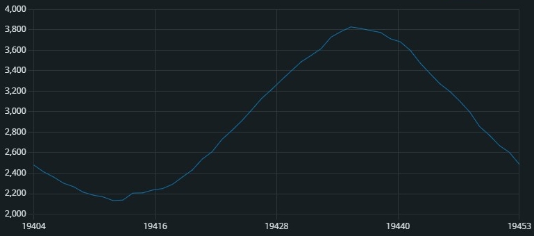
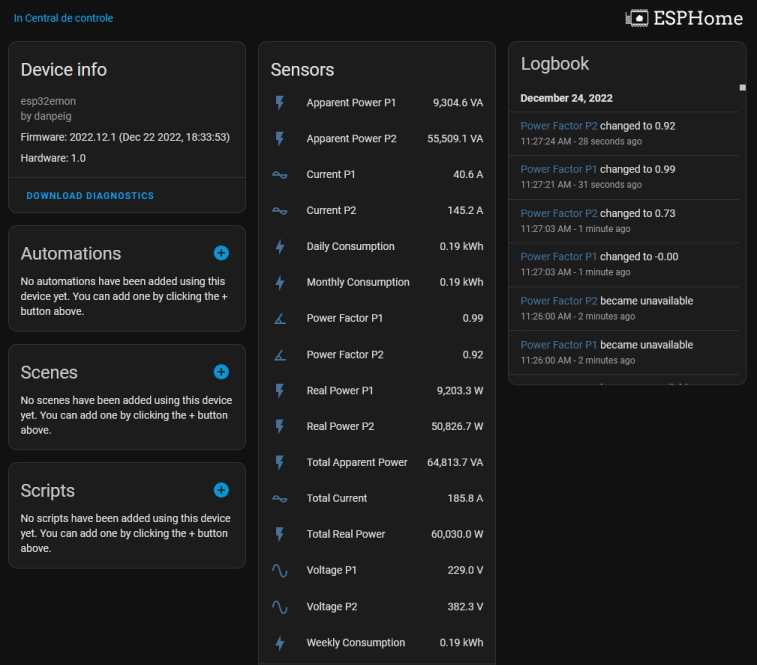

# ESP32 + ESPHome Open Source Energy Monitor

## Introduction
For months I've been looking for a non-intrusive energy monitoring solution for my home. The residence receives more than one phase from the utility company and the available solutions in the market based on open protocols are extremely expensive for this setup. Cheap alternatives always rely on cloud services and I don't believe any of them will remain online for too long.

The solution I present here is a DIY project built on the top of [Open Energy Monitor](https://openenergymonitor.org/) and [ESPHome framework](https://esphome.io/). I selected the ESP32 controller because it has several analog ports to measure voltage and current.

## Features
- 1 to 3 phase current measurement
- 1 to 3 phase voltage measurement
- Non-intrusive: There is no need to disconnect, cut or peel power cables
- [ESPHome](https://esphome.io/) based firmware
- Generic firmware (*calibrate-vi.ino*) that can run without ESPHome 
- Plug and Play integration with [Home Assistant](https://www.home-assistant.io/)
- Ready for [Home Assistant](https://www.home-assistant.io/) energy dashboard
- MQTT integration option
- Persistent data option (keep the values in case of power loss)
- No cloud services required
- 100% open source
- Uses low cost globally available components
- Outputs:
  - Apparent power (VA)
  - Real power (W)
  - Current (A, RMS)
  - Voltage (V, RMS)
  - Daily energy consumption (kWh)
  - Weekly energy consumption (kWh)
  - Monthly energy consumption (kWh)
  - Wifi connection stats (SSID, Signal and IP)

## Hardware

### Part list

N = number of phases to be measured (1, 2 or 3)

- 1 x ESP32 Dev Kit V1
- 1 x 5V USB power supply with micro USB cable
- 1 x ZMPT101B AC Transformer Module 250VAC, 5-30VDC. For most use cases, one voltage meter is enough even if there are more phases.
- N x SCT013 Split Core Current Transformer 100A-50mA. Other models can be used, see below.
- 2 x N x 10 kOhm resistor
- N x 10uF electrolytic capacitor
- N x 22 Ohm resistor. If using another range/model of current sensor, the resistance will change or the resistor will not be needed at all.
- N x 3.5mm stereo audio connector
- Wires and a prototype board for connecting everything


*Parts and preliminary assembly of the prototype board*


### Using a different model of the current sensor

There are currently two types of current sensors under the SCT013 family:
- Sensors that output current, typically 50mA
- Sensors that output voltage, typically 0-1V

The default circuit used for this project uses a 100A range transformer with a 50mA output. If you are going to use another range of sensor (10A, 15A, 30A, etc...) but still with mA output, you need to recalculate the burden (22&ohm;) resistor. Open Energy Monitor has a [nice tutorial](https://learn.openenergymonitor.org/electricity-monitoring/ct-sensors/interface-with-arduino) on how to do that.

If you decide to use a 0-1V output sensor, the burden resistor (22&ohm;) will not be required because it is already embedded in the probe. Later, in the software configuration, you need to adjust the ADC attenuation to improve the accuracy in this reading range of your probe.

### Multiple voltage measurements

If the energy monitor is going to be installed at the inlet of a property, the phases should be balanced and there is no reason for having more than one voltmeter. I understand that for some rare scenarios, the user would prefer to have different voltage measurements one per phase. Fortunately both the hardware and the software are prepared for that.

### ESP32 analog input pins

The ESP32 DEV Board has two ADC (Analog to Digital Converter) registers but due the Wifi communication, only one is available for this project. Therefore, sensors can only be connected to the following GPIOs: 32, 33, 34, 35, 36, 37, 38 and 39.


### Diagram and assembly

This diagram illustrates the typical connection of a single current probe and a single voltage probe. Multiple current probes require a set of resistors and capacitors for each one. The 22&ohm; burden resistor is not required for current probes that output 1V.

The voltage meter must be installed between the **neutral line** and one **phase**, not between phases.

The current clamp must be installed in a specific direction according to the current flow. Usually, the arrows in the clamp housing point to the right direction but don't hesitate to change if you note that the power factor and real power readings are too low.




## Software

The [project repository](https://github.com/danpeig/ESP32EnergyMonitor/) contains 3 firmware sources for the ESP32:
1. The voltage sensor potentiometer calibration tool. It is used only once to set the position of the potentiometer screw.
2. The voltage and current sensor calibration tool. It provides a quick way to determinate all calibration coefficients. You could do this directly from the ESPHome firmware but it takes much longer to compile, boot and measure. This tool can also be used to build your own firmware without using ESPHome.
3. The final ESPHome firmware source.

All tools require editing some configuration files before uploading to the ESP32 board.

**NOTE:** The EmonLib used in the package was modified by [Savjee](https://github.com/Savjee/EmonLib-esp32) to support the ESP32 board.

### Requirements
- [ESPHome](https://esphome.io/)
- [Arduino IDE 2.0 or higher](https://www.arduino.cc/)
- Any text editor for customizing the other files
- Micro USB cable to connect with the ESP32 development board
- Multimeter or voltmeter+ammeter for calibration
- Resistive load for calibration (at least 5A): heater, boiler, electric shower, electric oven, kettle, etc...

### Adding support for the ESP32 to Arduino IDE

Before we can compile ESP32 firmware using the Arduino IDE, we need to install the support for this board.

Add the following URL to the *Aditional Boards Manager* in Arduino IDE preferences:
```https://dl.espressif.com/dl/package_esp32_index.json```

For more information, there is a detailed tutorial in the reference links below.

## Calibrating the ZMPT101B potentiometer

The ZMPT101B has a potentiometer (blue component with a screw on top) that needs to be adjusted only once. The *calibrate-pot.ino* sketch was developed to be used with the Arduino IDE serial plotter for this task.

1. Set up the hardware
2. Plug the ZMPT101B to an AC voltage source. This voltage should be close to the voltage you will eventually read during the operation of this device. Do not connect to AC sources that generate square waves (no-break, inverters, etc...).
3. Edit *calibrate-pot.ino* and change the GPIO pin according to your hardware.
4. Compile and upload the code from Arduino IDE.
5. Open the Serial Plotter view, set baud rate to 115200bps.
6. Turn the potentiometer screw clockwise or counterclockwise until you see that the bottom and top of the curves transition from flat to curved. Do not exceed too much the transition zone (between flat top and curved top) because it decreases the sensibility of the sensor.


*Potentiometer not calibrated (flat top)*


*Potentiometer calibrated (round top)*

## Calibrating the current and voltage sensors

The sketch *calibrate-vi.ino* should be used to calibrate the current voltage sensors. It outputs the calibrated values every couple of seconds for each one of the sensors. The ESPHome firmware can also be used but the entire calibration process will take much longer since the device has a longer initialization cycle.

This piece of code can also be used to create your own Energy Monitoring solution without relying on ESPHome at all.

1. Set up the hardware, the potentiometer of the voltage sensor should be already adjusted.
2. Find an "almost pure" resistive load (no motors, no reactors, no electromagnets, no LEDs). Examples: heater, boiler, electric shower, electric oven, kettle...
3. Install a voltmeter and ammeter to use as reference.
4. Connect the voltage measurement and current measurement sensors. Please note the direction of the current clamp is important.
5. Edit the sketch *calibrate-vi.ino* and set the correct GPIO pins for the sensors. 
6. Set the calibration coefficients CV1, CV2, CV3, CI1, CI2 and CI3 to 1000 in the same file.
7. Compile and update the code from Arduino IDE.
8. Watch the values in the serial terminal and wait for them to stabilize. Use 115200bps as baud rate.
9. Take a note of the measured current (I) and voltage (V) from the ESP32 and the current and voltage from the reference voltmeter (Vr) and ammeter (Ir).
10. Calculate the calibration factors: CV<sub>new</sub> = Vr x CV<sub>old</sub>/V, CI<sub>new</sub> = Ir x CI<sub>old</sub>/I where CV<sub>old</sub> and CI<sub>old</sub> are the previous calibrations from the sketch (initially 1000).
11. Change the values under the "Calibration" section of the code to the calculated ones (CI<sub>new</sub> and CV<sub>new</sub>).
12. Compile and upload the code again, watch the serial monitor until the data stabilizes and then check if the measurements are correct.
13. Repeat steps 8 to 12 if necessary.

**TIP:** You can later fine tune the calibration by applying [ESPHome filters](https://esphome.io/components/sensor/index.html#sensor-filters) to each sensor. Note that the "Apparent Power" and "Real Power" will also require calibration because they are computed before the current and voltage filters kick in.

## Configuring the ESPHome firmware

### *esp32emon.h* configuration file

#### Minimum settings
- **Polling interval:** How frequent the device will read report the readings, defaults to 30s (30000ms). If under 5s, the Wifi or MQTT connection can crash due congestion.
- **Pin configuration:** The GPIO where each sensor is connected.
- **Calibration:** Coefficients for voltage (CV) and current (CI) sensors. Add the values obtained from the current and voltage sensor calibration steps.
- **Uncomment/comment** various code sections to enable/disable phases to be measured. Default is two phases enabled.
- **For the *Totals* block**: uncomment **only one block** corresponding to the total amount of phases to be measured.

#### Advanced/optional settings
- **Analog attenuation:** Adjust to improve the accuracy of sensors that operate at lower voltage ranges. This setting is per GPIO.
- **Sample window length / crossings:** How many half wavelengths will be used for the RMS voltage and current computations. Higher values will decrease the noise and make the readings more stable but the device will take longer to compute each one of the parameters. Too long values will activate the watchdog and the ESP32 will restart. Try 30, 60, 90 and 120 and see what fits best.
- **Watchdog timeout:** If the measurement takes too long, the ESP32 watchdog will assume the code crashed and will restart the device. Increase this if the device is restarting after using large crossing values.

### *secrets.yaml* configuration file
- **Rename the file *EXAMPLE_secrets.yaml* to *secrets.yaml*** and add/edit your passwords and login information for different services.

### *esp32emon.yaml* configuration file

#### Minimum settings
- **Custom sensors lambda function:** Uncomment (remove //) from the line corresponding to the amount of phases to me measured. Default is 2 phases. Do not leave more than one *return* line uncommented
- **Phase 1, 2 and 3 *sensor* blocks:** Uncomment (remove #) from the blocks corresponding the phases to me measured. Default is 2 phases so two blocks are enabled.

#### Advanced/optional settings
- **Wifi settings:** Enable/disable multiple networks. The SSID and passwords should be stored in the file *secrets.yaml*
- **MQTT integration:** Uncomment the block to enable MQTT integration. Servers and passwords should be stored in the file *secrets.yaml*
- ***Restore* setting for energy consumption:** Set to *true* to save the integrators value to the flash memory. This prevents data loss during power outages but can reduce the lifespan of the ESP32 device. If you are using Home Assistant you can keep it disabled because Home Assistant will keep track of the values even if the ESP32 counters reset.
- **Home Assistant integration:** There is no need to disable it, even if you are only going to use MQTT.

### Flashing ESPHome firmware to the ESP32 board

- Compile and upload: ```esphome run esp32emon.yaml```
- Compile and upload to a remote device using the IP address (if automatic host detection fails): ```esphome run esp32emon.yaml --device= 192.168.0.15```

Please refer to [ESPHome website](https://esphome.io/guides/getting_started_command_line.html) for detailed instructions.

**TIP:** If you want to go fast, avoid Docker version of ESPHome, use [manual installation](https://esphome.io/guides/installing_esphome.html) instead. The connection to hardware devices from the manual installation is much easier than from a container.

## Home Assistant Integration

Home Assistant integration is enabled by default. The device should be automatically discovered if in the same network as the Home Assistant server (it can take a up to 30 minutes). If not, add the integration manually using the IP address of ESP32 as host address.

If you have a complex Home Assistant setup, with multiple networks or servers and the default integration does not work, you can fall back to the Home Assistant MQTT mode. Just enable MQTT and the discovery mode in *esp32emon.yaml*.


*Home Assistant Integration after automatic detection*

## MQTT Integration

MQTT integration is disabled by default. To enable, uncomment the lines in the yaml configuration file and adjust the settings in the *secrets.yaml* file.

## Frequently asked questions

- **Can I use a CT clamp rated for another current (20A, 30A, etc...)?** Yes but you need to recalculate the burden resistor or eliminate it. 

- **I don't have a neutral wire. Can I use 2 phases for voltage measurement?** Yes, but you need to change the power calculations in the code.

- **Losing Wifi, MQTT connection or constant reboots:** Try to decrease the CROSSINGS setting in *esp32emon.h*. The blocking nature for Emonlib sometimes does this.

- **ESPHome webserver is crashing:** The web server was disabled because it was crashing the ESP32. due the blocking nature of Emon library. You may be able to run it if you decrease the CROSSINGS setting in *esp32emon.h*.

- **Voltage and current are displayed but the power is incorrect or the power factor is too low:** Double check the CT clamp connections. Try inverting the clamp direction in the wire. 

## Download
- [GitHub Release](https://github.com/danpeig/ESP32EnergyMonitor/releases/)

## Version history
- 1.4 (02/04/2023)
  - Fixed Wifi Signal % device class error
  - Improved instructions regarding correct direction of the CT probe
- 1.3 (10/01/2023)
  - Added filters to all sensors to prevent integrators corruption.
- 1.2 (31/12/2022)
  - Changed Power Factor state class to "measurement" to prevent log pollution
- 1.1 (27/12/2022)
  - Added Wifi connection status outputs
  - Improved current and voltage calibration output visuals
- 1.0 (24/12/2022)
  - Initial release

## Further reading and references
- [Savjee Home Energy monitor with ESP32](https://savjee.be/blog/Home-Energy-Monitor-ESP32-CT-Sensor-Emonlib/)
- [EmonLib for ESP32 from Savjee](https://github.com/Savjee/EmonLib-esp32)
- [IoT Based Electricity Energy Meter using ESP32 & Blynk](https://how2electronics.com/iot-based-electricity-energy-meter-using-esp32-blynk/)
- [Zmpt101b Precision Voltage Sensor Module](https://community.home-assistant.io/t/zmpt101b-precision-voltage-sensor-module/124617/13)
- [Open Energy Monitor original EmonLib](https://github.com/openenergymonitor/EmonLib)
- [Open Energy Monitor - Interfacing CT sensors with Arduino](https://learn.openenergymonitor.org/electricity-monitoring/ct-sensors/interface-with-arduino)
- [Measure AC voltage with ZMPT101B and ESP8266 12E](https://www.hackster.io/SurtrTech/measure-ac-voltage-with-zmpt101b-and-esp8266-12e-24e367)
- [ESP32 ADC – Read Analog Values with Arduino IDE](https://randomnerdtutorials.com/esp32-adc-analog-read-arduino-ide/)
- [Installing ESP32 libraries on Arduino IDE 2.0](https://randomnerdtutorials.com/installing-esp32-arduino-ide-2-0/)
